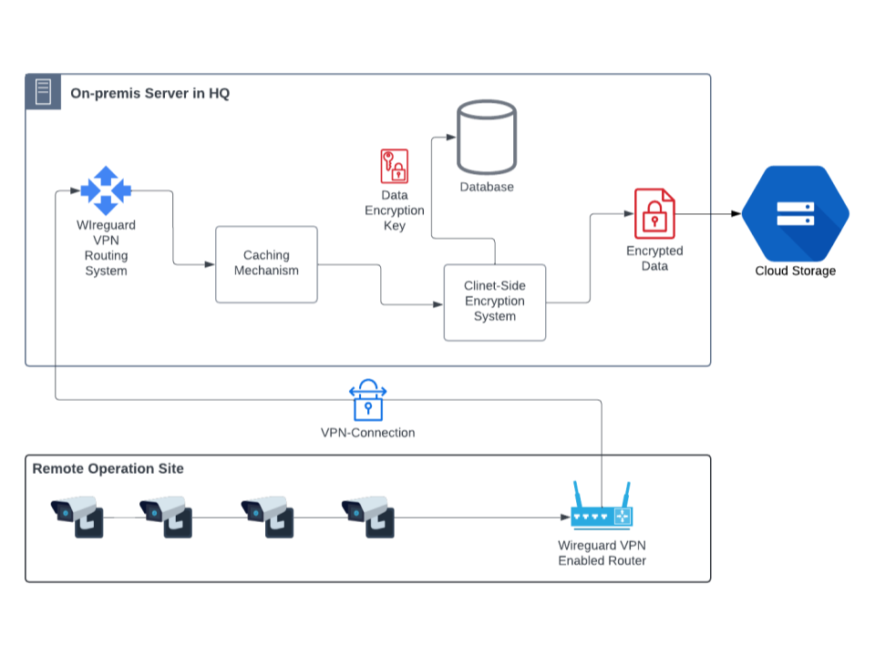

# CCTV Cloud VMS Software

## Description
**Introducing a Cloud-Based Video Management System Designed for Unparalleled Control and Cost Efficiency**

Empower your business with a comprehensive video surveillance solution that delivers unparalleled security, convenience, and cost savings.

Our Cloud Video Management System Software seamlessly integrates with Google Cloud Storage, providing a robust platform for managing and accessing your video footage from anywhere, anytime.

## Key Features:
 - **Effortless Cloud Integration**: Optimize storage and accessibility with seamless integration to Google Cloud Storage, eliminating upfront costs and ensuring scalability on demand.
 - **Intuitive Playback Interface**: Streamline video navigation with a user-friendly interface featuring a precise timestamp-based seeking bar, making footage retrieval effortless.
 - **Unrestricted Remote Access**: Connect to CCTV devices across dispersed locations, even those without public IPs, through cutting-edge VPN technologies. Stream live video and manage device settings remotely for comprehensive control.
 - **Uncompromising Data Privacy**: Safeguard sensitive footage with robust client-side encryption, guaranteeing exclusive access to your videos. Google has no visibility or access to your data.
 - **Proactive System Maintenance**: Minimize downtime and ensure optimal performance with 24/7 automated troubleshooting features that address potential issues proactively.
 - **Exceptional Cost-Effectiveness**: Eliminate upfront storage expenses and leverage the cost-efficiency of Google Cloud Platform, making this solution a perfect fit for businesses of all sizes.
Experience a truly secure, accessible, and affordable surveillance solution that exceeds expectations. Contact us today to unlock the full potential of our Cloud Video Management System Software.

## Benefits
- **Accessibility and Convenience**: Access live stream or playback footage with extended retention periods from anywhere via our user-friendly web application.
- **Cloud Platform Based Off-Site Storage**: Store footage securely in the cloud, eliminating the risk of physical damage or loss.
- **Data Protection and Security**: Ensure the safety and integrity of surveillance footage with robust data protection measures.
- **Scalability and Flexibility**: Easily scale the storage capacity to accommodate growing surveillance needs.
- **Cost-Effectiveness**: Save costs by utilizing our solution instead of investing in expensive hardware or other cloud services.
- **Real-time Backup and Sync**: Automatically back up and synchronize surveillance footage in real-time for added peace of mind.
- **Surveillance Device Maintenance**: Reduce the burden of maintenance for surveillance devices, as the system automatically maintain all devices added to our system.
- **Customizeable Freatures**: Develop various types of customizeable features according to business requiremnts.

## Comparative Analysis
### Traditional Solution (NVR or DVR) Vs. Cloud-Based VMS Solution
- Traditional systems does not offer off-site backup of footage
- Traditional systems require purchasing and maintaining hard drives.
- Traditional system hard drives may crash, leading to data loss.
- Traditional systems lack protection against tampering or accidental/malicious deletion.

### Hardware Solution (SAN or NAS) Vs. Cloud-Based VMS Solution
 - High upfront costs: Requires significant initial investment in hardware.
 - Limited scalability: Physical storage capacity is restricted by hardware.
 - On-premises management: Limited remote access and management capabilities.
 - Manual maintenance: Requires ongoing hardware upkeep and troubleshooting.
 - Complex disaster recovery: Requires additional backup and recovery strategies.
 - Lengthy deployment: Hardware installation and configuration can be time-consuming.

### Other Cloud-Based Surveillance Solutions
[This article](https://solink.com/resources/cloud-based-video-surveillance-systems/) provides a valuable overview of available cloud surveillance solutions. However, for businesses seeking the most budget-friendly option, this software stands out with its zero upfront hardware investment, scalable pay-as-you-go GCP storage, and automatic resource management. These features translate to real cost savings compared to competitor solutions.

### Why This Cloud-Based Solution
This software is more affordable option, delivering excellent value for money. It can store 12 FPS HD footage with retention period up to 3 months for just 2.51 USD ~ 1.26 USD per month. With minimal motion in footage and GCP discount it can be reduced up to 50%.

## Technical Architecture
In this software, all DVRs, NVRs, and IP cameras at remote locations will establish a secure VPN tunnel without any public IP to clients on-premis server. The recorded footage will be stored in Google Cloud Storage, with client-side encryption on your on-premis server ensuring reliable and scalable storage capabilities. To access the footage and utilize various services, client users will interact with web applications. They will have the ability to perform tasks such as live streaming, playback, and leverage additional functionalities provided by the application.

## Further Development
We are actively working on incorporating the following features:
- Enhanced web application for an improved user experience.
- Robust automatic maintenance system to streamline operations.
- Rigorous testing for ensuring scalability and security.
- Proper CI/CD pipelining for seamless software deployment.
- Analytics system powered by AI for insightful surveillance data analysis.

## Targeted Audience
This software is an ideal solution for businesses with a distributed operational footprint, offering seamless integration, extended retention capabilities, and efficient access to playback footage and live streams. It caters specifically to organizations that:

- **Require Off-Site Storage:** Ensuring secure storage in the cloud to mitigate the risk of physical damage or loss.
- **Require Live Video Feed of All Cameras:** Providing real-time access to live video feeds from all connected surveillance cameras.
- **Require Maximum Retention Period:** Offering extended retention periods to meet the unique needs of businesses that necessitate prolonged storage of surveillance footage.
- **Require Proper Security and Maintenance of All Surveillance Devices:** Implementing robust security measures and automated maintenance systems to ensure the integrity and optimal performance of all surveillance devices.
- **Have Multiple Remote Operation Sites:** Addressing the challenges of managing surveillance across dispersed locations by offering remote access and centralized control.
- **Can Offer Required Internet Bandwidth Support:** Possessing the capability to provide the necessary internet bandwidth in all remote locations. This ensures smooth streaming of video footage from remote locations to the on-premise server and from the on-premise server to Google Cloud.

This software is tailored to meet the specific demands of organizations seeking a secure, accessible, and scalable surveillance solution, with a focus on off-site storage, live video feeds, extended retention, device security, maintenance, and the ability to support required internet bandwidth across multiple remote operation sites.

## Frequently Asked Question
Go to this link to see [FAQs](FAQs.md)

## Contact
**A2Z Techub**
Daffodil International University
Daffodil Smart City-DSC, Birulia. Savar, Dhaka-1216, Bangladesh
Email: sudipshourja@gmail.com, adhikary15-5582@diu.edu.bd
Cell: +880 1775-624505, +880 1888-524620
